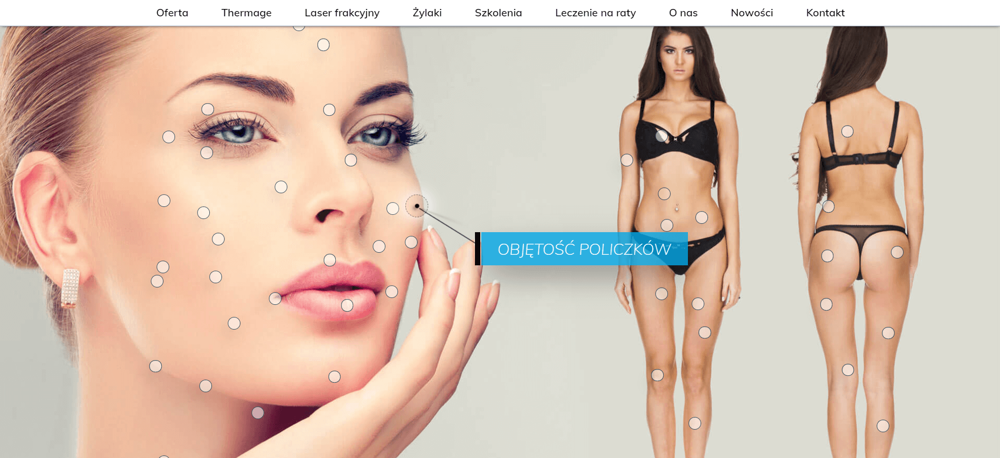
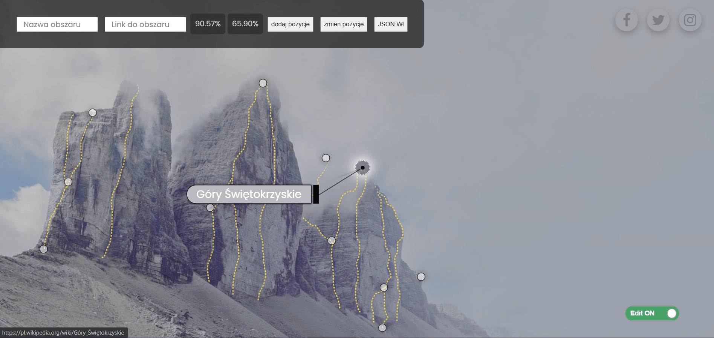
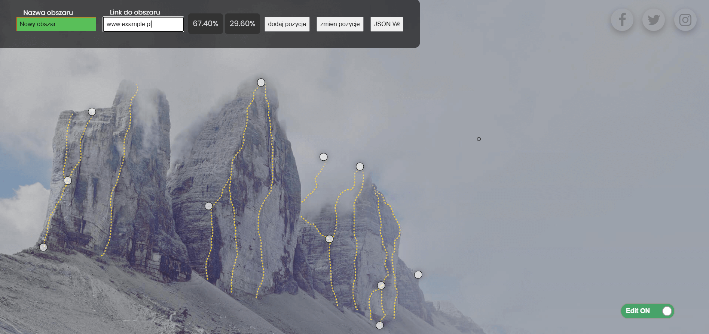
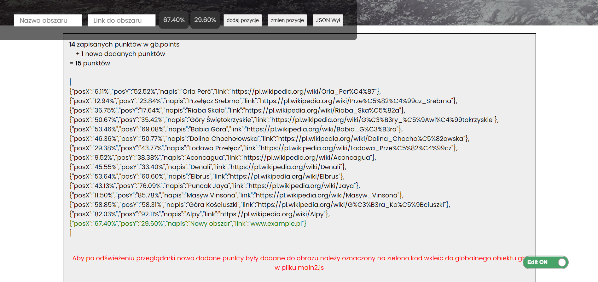
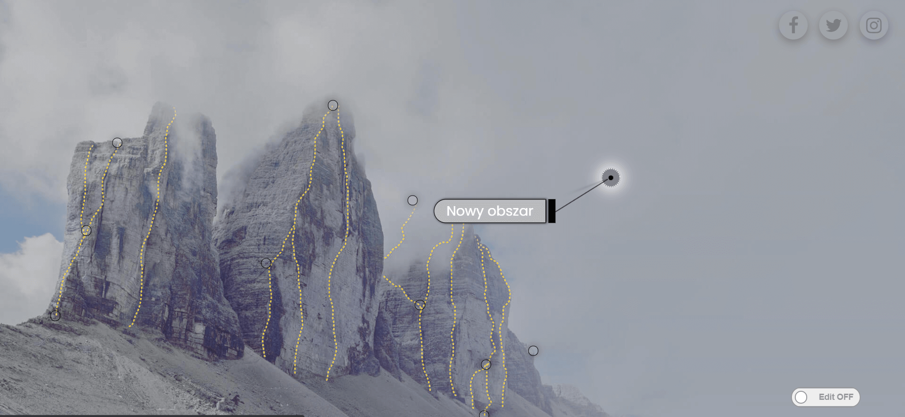

# #2 Mountains - adding points to the image 
> A mechanism for adding points to the image that generates its coordinates along with a possible name and a link to that point. 
[Mountains](http:/www.provo.webd.pro/mountains/)

## Table of contents
* [General info](#general-info)
* [Screenshots](#screenshots)
* [Technologies](#technologies)
* [Status](#status)
* [Inspiration](#inspiration)

## General info
The project was created as a training and was aimed at eliminating the tedious, manual addition of points on images, e.g. on a page www.bellazone.pl

Just click on the area of interest, add a name and / or link and press the 'dodaj pozycje' button.
JSON code will be generated, which we can copy to our project.

*I did not implement RWD on the website because no developer writes code on a tablet or mobile :)

## Screenshots

## Technologies
* CSS - version 3
* HTML - version 5
* JavaScript
* jQuery
* JSON
* SCSS

## Status
Project is: _no longer continue_ 
The project was only part of the training and I do not see the need to extend it with further facilities

## Inspiration
The project was created during the course in which I participated - www.jupiter.czest.pl
